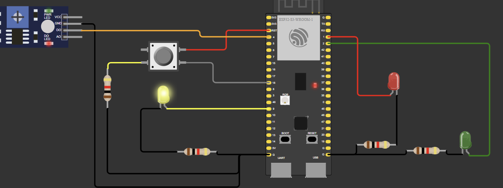

## Modo Dia

Durante o modo dia, o semáforo fica 3 segundos no verde, 2 no amarelo e 5 no vermelho. Caso o semáforo esteja brilhando vermelho e o botão for precionado, depois de um segundo ele muda para verde. Ele permanece assim enquanto o sensor de luz detectar que está mais claro que o limite.

 Figura 1 - Modo Dia 

 
 
## Modo Noite

Durante o modo noite, o semáforo fica 1 segundo ligado no amarelo e 1 desligado. Ele permanece assim enquanto o sensor de luz detectar que está menos claro que o limite.

 Figura 2 - Modo Noite 

